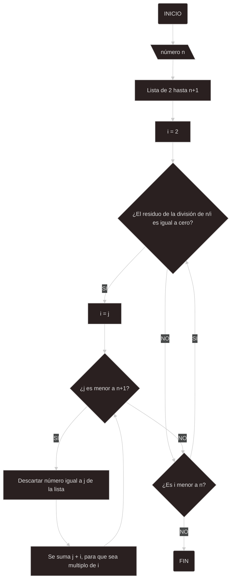

# Reto_3
### Plantear el algoritmo para obtener los números primos hasta n, usando pseudocódigo y diagramas de flujo.
Para la creación del diagrama y pseudocódigo se hizo uso de la criba de Eratóstenes, además se consultó un [código externo](https://www.pythonparatodo.com/?p=353) en internet para poder ver como se debían ver los procesos indentados que hacen el descarte de números no primos.

El algoritmo consiste de una lista que por medio de ciclos repetitivos descarta los números que tienen más multiplos que el 1 y ellos mismos, para esto se inicia con un condicional en donde se separan los números divisibles por el número que en ese momento este adoptando i, tras esto guarda el valor de i en una nueva variable la cual va aumentar en razón del multiplo encontrado, hasta encontrar todos los multiplos de dicho número y descartarlos de la lista creada en un inicio, este proceso se repite hasta que los números que queden solo sean divisores de sí mismo y uno.

## Diagrama de flujo

## Pseudocódigo

